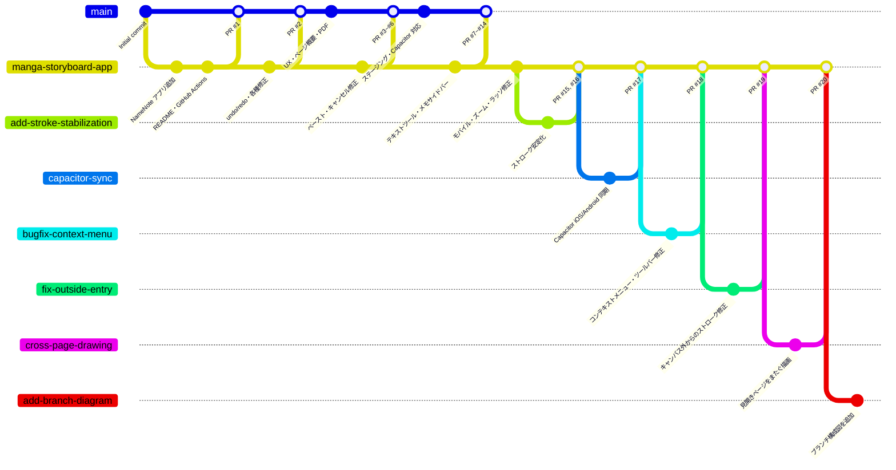

# ブランチ構成図

## ブランチ一覧

| ブランチ名 | 役割 |
|---|---|
| `main` | 本番ブランチ（PR #1〜#14 のマージ先） |
| `claude/manga-storyboard-app-WD9ba` | メイン開発ブランチ（現在の最新） |
| `gh-pages` | GitHub Pages 自動デプロイブランチ |
| `claude/add-stroke-stabilization-BXOOH` | ストローク安定化機能（PR #15, #16） |
| `claude/capacitor-sync-XQPRT` | Capacitor iOS/Android 同期（PR #17） |
| `claude/bugfix-context-menu-history-filepicker-VKWMN` | コンテキストメニュー等バグ修正（PR #18） |
| `claude/fix-outside-entry-edge-point-RQKLM` | キャンバス外入力バグ修正（PR #19） |
| `claude/cross-page-drawing-HKMVW` | 見開き跨ページ描画機能（PR #20） |
| `claude/add-branch-diagram-jzDay` | ブランチ構成図追加（現在のブランチ） |
